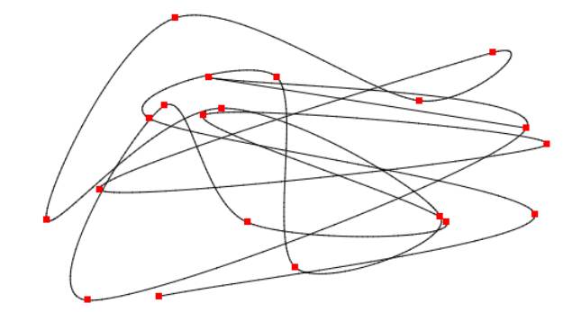

# Cardinal spline

Generate cardinal splines in 2 or 3 dimentions




(rendered using [npmcad](https://github.com/dominictarr/npmcad-viewer))

# example

``` js
var spline = require('cardinal-spline')

var points = spline([ //array of control points
    [x,y,z],...
  ],
  0.5, //tension
  20 //number of segments between each control point
)
```

## License

adapted from [epistemex/cardinal-spline-js](https://github.com/epistemex/cardinal-spline-js)

Released under [MIT license](http://choosealicense.com/licenses/mit/). You can use this class in both commercial and non-commercial projects provided that full header (minified and developer versions) is included.

*&copy; 2013-2017 Epistemex*


